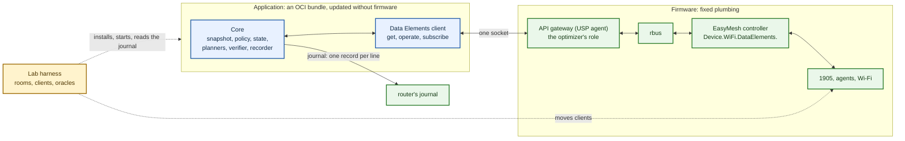

# The optimizer as an application, on Data Elements

[Documents](../README.md)

A proposal: an assessment of what stands between today's optimizer and an optimizer
that runs as a downloadable application on the router, and a design to get there. No
code is changed by it. It was written on 2 October 2026 from:

- this repository at that date;
- the apps lab ([apps.vcpe.dev](https://apps.vcpe.dev/)): its documents and the DAC
  router image it builds, read from the image's root filesystem (the lab VM was not
  running);
- the RDK lab's router, live and read-only: the Data Elements it publishes on rbus and
  its USP agent;
- prplMesh, from the adapter this repository already has for it.

What was observed is said as fact. What was not exercised is marked **to verify** and
has an experiment in [Experiments](#experiments). No command was invoked on a live
controller: no steer, no query, no write.

## The goal and its two rules

The optimizer's algorithm improves in the labs faster than a router's firmware is
released. The goal is to ship the optimizer core as an **application** of the router's
apps framework, so that a better algorithm reaches a router as an application update,
without a firmware update.

Three things are fixed by that goal:

- **The apps framework is taken as it is.** DAC (DSM and Dobby) or LCM (timingila and
  cthulhu), the USP agent in front of the data model, their limits and their defects.
- **EasyMesh is fixed plumbing.** The controller, the agents, the 1905 layer and the
  Wi-Fi manager stay in the firmware. They are not applications.
- **The optimizer may change in any way it needs.**

Two rules follow for the optimizer:

1. **It runs inside the confinement the apps framework imposes**, and reaches its
   telemetry and its control plane only over what the framework lets an application
   reach.
2. **It speaks only Data Elements** (`Device.WiFi.DataElements.`): one interface for
   everything it reads and everything it asks for, on every stack.

## Findings at a glance

| # | Finding | Effect | Proposed answer |
| --- | --- | --- | --- |
| 1 | The decision core is already pure; everything around it is lab-shaped (`lxc exec`, the lab's web API, a raw 1905 socket, client containers) | none of today's adapters can run in an application | split core, application and lab harness; one Data Elements client replaces the adapters ([P1](#p1-the-adapters-are-lab-adapters)) |
| 2 | The RDK controller publishes Data Elements on rbus: 517 entries; a whole-network read takes 0.37 s | the single interface exists and is fast enough to poll | build the snapshot from it ([Data Elements as found](#data-elements-as-found)) |
| 3 | The framework's API gateway, the USP agent, does not know Data Elements | an application cannot read them through the gateway | add them to the gateway's data model configuration in the image ([P2](#p2-the-gateway-does-not-carry-data-elements)) |
| 4 | The gateway's configured data model has parameters only: no commands, no events | steering cannot be asked through the gateway as configured | decide between the bus and a narrow door; experiment first ([P3](#p3-the-gateway-carries-no-commands-and-no-events)) |
| 5 | Nothing of the router is inside a container unless the bundle mounts it | the application reaches no data model at all by default | mount exactly one socket; nothing else ([P4](#p4-reaching-the-data-model-from-inside-the-container)) |
| 6 | rbus has no access control; the gateway has roles | the bus gives an application the whole router | a least-privilege role on the gateway; the bus only as a lab step ([P5](#p5-least-privilege)) |
| 7 | Several RDK entries are placeholders (steering policy, thresholds, measurement reports, unassociated stations); the station timestamp is missing from bulk reads | candidate measurement and policy baseline are not available through Data Elements on RDK today | a short list of one-time plumbing fixes ([P7](#p7-candidates-are-not-available-through-data-elements-on-rdk), [P8](#p8-freshness)) |
| 8 | Load is read from a raw IEEE 1905 socket in the controller's network namespace | impossible in a container and outside rule 2 | read utilization and counters from Data Elements ([P9](#p9-load-comes-from-a-raw-socket)) |
| 9 | Only one event is registered on RDK (failed connection) | association changes must be polled | poll with bounded cost; events where a stack has them ([P10](#p10-no-events-so-polling)) |
| 10 | The lab's verifier uses the client's own link and traffic | not available on a router | the model is the only plane; say so in the record ([P11](#p11-the-verifier-loses-its-oracles)) |
| 11 | The container's writable space is small tmpfs; an update is uninstall and install | per-client state and the journal do not survive an update | start safe after every start; journal to the router's journal ([P13](#p13-state-does-not-survive-an-update)) |
| 12 | Bundles come over plain HTTP, unsigned | an algorithm update is as trustworthy as its URL | a limitation to accept for the lab and to close before production ([P14](#p14-updates-are-unsigned)) |
| 13 | The optimizer is Python 3.10 with no dependencies; the router's userspace is 32-bit x86 in the lab and ARM on a product | the bundle must carry its interpreter, or the core must be ported | Python bundle first, port decided on measured footprint ([P12](#p12-python-in-a-bundle)) |

## What the optimizer touches today

The package's dependencies are empty: Python 3.10 or later and the standard library.
What it reaches outside its own process:

| Reaches | For | How | In an application |
| --- | --- | --- | --- |
| the RDK lab's web API, `127.0.0.1:8888` (`/api/v1/topology`, `clients`, `bsses`, `devices`, `coordination`) | topology, associations, current-link metrics | HTTP, [observer.py](../../optimizer/observer.py) | no: that API is `onewifi_em_cli`, a lab process of about 111 MiB that a product does not run |
| the same API, `POST /api/v1/unassoc_sta_query` | candidate RCPI | HTTP, [candidates.py](../../optimizer/candidates.py) | no, as above |
| the same API, `POST /api/v1/ap_metrics_query`, `steer-native` | load query, native steer | HTTP, [actuator.py](../../optimizer/actuator.py) | no, as above |
| the lab's steering script | the steer | `lxc exec bpibroadband -- steer.sh`, [actuator.py](../../optimizer/actuator.py) | no: a host command into a container |
| prplMesh's topology adapter, `127.0.0.1:8092` | topology, associations | HTTP, [prplmesh.py](../../optimizer/prplmesh.py) | no: a lab server; but what it reads is Data Elements |
| prplMesh's NBAPI | candidates (`AddUnassociatedStation()`, `Radio.UnassociatedSTA`) | `ubus` through `lxc exec` or `nsenter` into the controller, [lxd_ubus.py](../../optimizer/lxd_ubus.py) | the transport no; the interface yes: it is Data Elements |
| the controller's network namespace | native load reports | `nsenter` and a raw `AF_PACKET` socket on EtherType `0x893a`, or prplMesh's broker socket, [load_capture.py](../../optimizer/load_capture.py) | no, and it bypasses the data model |
| the client containers | band scans, ping, iperf3 | `lxc exec`, [band_scan.py](../../optimizer/band_scan.py), [traffic.py](../../optimizer/traffic.py) | no: lab oracles, never a product input |
| files | the policy (YAML), the journal (append-only), scenarios, the medium's worlds | the filesystem | policy and journal yes, with limits; the rest is lab |

The parts that take no I/O at all are the ones that carry the algorithm: the snapshot
model, the policy and its state machine, the planners, the load policy and counter
guard, the recorder's hash chain and replay. They are what the application is for.

## What an application is given

### The container

For both frameworks as the apps lab builds them, an application is an OCI bundle
(`rootfs/` and `config.json` in a tar), fetched from a URL and run by crun. The bundle's
`config.json` is the application's own: what it asks for is what it gets, within what
the runtime allows. The apps lab's own bundles ask for:

- namespaces: pid, ipc, uts and mount. **No network namespace**: the container shares
  the router's network. No user namespace: the process is uid 0 inside and outside;
- capabilities: `CAP_AUDIT_WRITE`, `CAP_KILL`, `CAP_NET_BIND_SERVICE`, with
  `noNewPrivileges`;
- a read-only root; tmpfs for `/tmp` (64 MiB) and `/var` (8 MiB); no device access;
  the usual masked and read-only `/proc` paths; 1024 open files; no seccomp profile and
  no memory limit;
- Dobby's logging plugin: stdout and stderr go to the router's journal.

That is a permissive bundle, and the optimizer should ask for less (see
[the bundle](#the-bundle)). The DAC image has these Dobby plugins: logging, networking,
ipc, storage, minidump, OOM-crash, multicast sockets. Dobby's own settings name
`eth0` and `wlan0` as external interfaces and `100.64.11.0` as the container address
range; the router's interfaces are `erouter0` and `brlan0`, so Dobby's private (NAT)
networking is **to verify** before anything relies on it.

On LCM, cthulhu makes an unprivileged user for every container not installed as
privileged; the apps lab found that the unit's status lags, that a stopped unit does
not start again, and that boolean arguments do not arrive over USP. The first target is
therefore DAC.

### The lifecycle

The router presents TR-181 `Device.SoftwareModules.`: `InstallDU()` from a URL, then
`SetRequestedState(Active|Idle)` on the execution unit, then uninstall. From the apps
lab's results on the DAC router:

- bundles come **over HTTP only**, and a deployment unit's identity is its URL;
- the execution unit's name is generated, and it is the name of the container and of
  its output in the journal;
- there is no tested in-place update: a new version is another URL, installed after or
  beside the old one;
- DSM crashed once on an uninstall and does not restart by itself; after a restart it
  can keep a package it no longer has.

### The gateway

The toolkit's name for the application's way to the router is the **API gateway**; its
own page for it is still a TODO. As built, the gateway is the USP agent (obuspa
10.0.11 with RDK's vendor plugin), in front of rbus:

- **Its data model is configured, not discovered.** Two files in the image list what
  USP can reach: `usp_dm_objs.conf` (58 objects) and `usp_dm_params.conf` (1898
  parameters, each with a type and `RO` or `RW`). Anything not listed does not exist
  over USP.
- **`Device.WiFi.DataElements.` is not listed.** On the RDK lab's router,
  `obuspa -c get Device.WiFi.DataElements.Network.ID` answers "does not exist in the
  schema", while rbus returns the value.
- **The files hold parameters only.** No command and no event appears in them. The
  commands the agent does offer (`Device.SoftwareModules.InstallDU()` and its
  relatives) come from compiled code, not from the configuration.
- **It has roles.** Two roles exist; a controller is assigned one.
- **It listens for local clients on Unix sockets**, in the apps image:
  `/var/run/usp/broker_controller_path` and `/var/run/usp/broker_agent_path`. In the
  EasyMesh image the agent runs, but its factory-reset file is a dangling link and no
  socket or transport is configured.
- `obuspa -c` on the router is a controller with full rights, through the agent's own
  command socket. It is a tool, not a way for an application.

rbus itself is not in a container. The toolkit's own `speedtest` example gets it by
mounting the bus into its container. rbus has no notion of who is asking.

## Data Elements as found

### RDK

The controller's `tr_181_service` registers **517 entries** under
`Device.WiFi.DataElements.` on rbus. With 6 devices and 24 stations in the lab:

- a read of the whole `Network.` subtree returns 3156 values in **0.37 s**;
- partial paths work (`…Device.1.Radio.2.` returns that radio); **wildcards do not**
  (`Device.*.ID` fails);
- a bulk read returns only part of what a direct read returns: the station's
  `TimeStamp`, for one, is absent from the bulk read and present when asked for by
  name.

| What | Entries | State |
| --- | --- | --- |
| devices, backhaul | `Device.{i}.ID`, `BackhaulMACAddress`, `BackhaulMediaType`, `Manufacturer…` | populated |
| radios | `Radio.{i}.ID`, `Enabled`, `Noise`, `Utilization`, `CurrentOperatingClassProfile.{i}.Class`, `Channel` | populated; `Transmit`, `ReceiveSelf`, `ReceiveOther` are 0 |
| BSSs | `BSS.{i}.BSSID`, `SSID`, `Enabled`, `FronthaulUse`, `BackhaulUse`, `STANumberOfEntries`, `TimeStamp`, byte counters | populated; `TimeStamp` moves slowly |
| stations | `STA.{i}.MACAddress`, `SignalStrength` (RCPI), `LastDataDownlinkRate`, `LastDataUplinkRate`, `EstMACDataRate…`, `BytesSent`, `BytesReceived`, `PacketsSent`, `PacketsReceived`, `ErrorsSent`, `ErrorsReceived`, `RetransCount`, `LastConnectTime`, `ClientCapabilities`, `HTCapabilities` | populated |
| station freshness | `STA.{i}.TimeStamp` | populated on a direct read and advancing with the reports (3 to 4 s behind the clock on two reads 7 s apart); absent from bulk reads |
| network freshness | `Network.TimeStamp` | two hours old: not a freshness signal |
| candidates | `Radio.{i}.UnassociatedSTA.{i}.MACAddress`, `SignalStrength`, `Channel`, `OperatingClass`; `Device.{i}.X_AIRTIES_UnassociatedStaLinkMetricsQuery()` | registered; `UnassociatedSTANumberOfEntries` is a placeholder; **to verify** |
| measurement reports | `STA.{i}.MeasurementReport`, `NumberOfMeasureReports` | placeholders |
| policy and thresholds | `Radio.{i}.SteeringPolicy`, `RCPISteeringThreshold`, `ChannelUtilizationThreshold`, `STAReportingRCPIThreshold`, `Device.{i}.STASteeringState` | placeholders (each answers boolean `false`); `Device.{i}.APMetricsReportingInterval` answers 0; `LocalSteeringDisallowedSTAList` fails |
| steering | `STA.{i}.ClientSteer()`, `STA.{i}.MultiAPSTA.Disassociate()`, `Device.{i}.MultiAPDevice.Backhaul.SteerWiFiBackhaul()` | registered; **not exercised** |
| channel | `Radio.{i}.ChannelScanRequest()`, `ChannelSelectionRequest()`, `ScanResult.` | registered; not exercised |
| events | `FailedConnectionEvent.FailedConnection!` | the only event registered; no association or disassociation event |
| topology | `Network.Topology` | one JSON string of the controller's own; not Data Elements |

### prplMesh

prplMesh's northbound API **is** Data Elements, on ubus. The optimizer's prplMesh
adapter and the lab's steering already use it and nothing else:

- reads with search paths, which work there
  (`Device.*.Radio.*.BSS.*.STA.`, `Device.*.Radio.*.UnassociatedSTA.`);
- candidates: `AddUnassociatedStation()` on the radio, results in
  `Radio.{i}.UnassociatedSTA.{i}` with `SignalStrength` and a vendor timestamp,
  `X_PRPLWARE-COM_TimeStamp`;
- the steer: `BTMRequest()` on the station object, with the target BSS and the BTM
  timers.

The topology adapter on port 8092 is a lab server over the same NBAPI: removing it
loses nothing that is not in the data model.

### What the snapshot needs, and where it is

| The optimizer needs | Data Elements | RDK | prplMesh |
| --- | --- | --- | --- |
| which devices, radios and BSSs exist; band and channel | `Device`, `Radio`, `CurrentOperatingClassProfile`, `BSS` | yes | yes |
| which station is on which BSS | `BSS.{i}.STA.{i}.MACAddress` | yes | yes |
| current-link RCPI, rates | `STA.{i}.SignalStrength`, `LastData…Rate` | yes | yes |
| when that was measured | `STA.{i}.TimeStamp` | by direct read only | yes |
| station counters | `STA.{i}.BytesSent…RetransCount` | yes | yes (unit of 1024 bytes) |
| load | `Radio.{i}.Utilization`, `Noise`; `BSS.{i}` counters | utilization and noise yes | yes |
| candidate RCPI on another radio | `Radio.{i}.UnassociatedSTA.{i}` and a query command | placeholder | yes, with a vendor command and timestamp |
| cross-band evidence | `STA.{i}.MeasurementReport` (beacon reports) | placeholder | not used today |
| client capability (BTM) | `STA.{i}.ClientCapabilities` | yes (the association frame) | yes |
| to steer | a command on the station | `ClientSteer()`, not exercised | `BTMRequest()` |
| that agents do not steer by themselves | `Radio.{i}.SteeringPolicy`, the disallowed lists | placeholders | **to verify** |
| reporting intervals | `Device.{i}.APMetricsReportingInterval` and the reporting thresholds | placeholders | **to verify** |

## Problems, fixes and alternatives

### P1: the adapters are lab adapters

**Problem.** Every observer, candidate provider and actuator reaches the controller
from the lab VM: a lab web API, `lxc exec`, `nsenter`, a host script. None of it exists
on a router, and none of it would pass the framework's confinement.

**Fix.** Three parts instead of one package:

- the **core**: model, policy, state, planners, load policy, counter guard, recorder,
  replay. No I/O; already nearly so;
- the **application**: the core, a Data Elements client, a loop, a journal writer. It
  is what goes into the bundle;
- the **lab harness**: the room service, the acceptance tools, the client-side oracles,
  `simulate`. It stays in the lab VM and drives the same application.

**Alternative.** Keep the adapters and add an application adapter beside them. It keeps
two ways to observe the same mesh, and the application would be the less-tested one.

### P2: the gateway does not carry Data Elements

**Problem.** Over USP the path does not exist, although the controller publishes it on
rbus. An application that goes only through the gateway sees no mesh.

**Fix.** Add the Data Elements objects and parameters the optimizer reads to the two
configuration files of the gateway, in the image that carries EasyMesh. It is image
configuration next to the EasyMesh integration, not a change to the framework: about
a hundred lines for the subset in the table above.

**Alternatives.**

- The controller's `tr_181_service` registers itself with the agent as a USP service,
  and brings its own data model, commands included. This agent version has the broker
  for it and the apps image configures its sockets. It is the cleanest end state and
  the largest change to the plumbing.
- Mount rbus into the container and skip the gateway ([P4](#p4-reaching-the-data-model-from-inside-the-container)).

**To verify.** That a configured table path with three levels of index
(`Device.{i}.Radio.{i}.BSS.{i}.STA.{i}`) works through the vendor plugin, and what a
whole-network read costs over USP against 0.37 s on rbus (E2).

### P3: the gateway carries no commands and no events

**Problem.** Even with the parameters added, the configuration has no way to name a
command. The steer (`ClientSteer()`), the candidate query and the channel requests are
commands. Without them the application can watch and recommend, and never act.

**Fix.** Decide after one experiment (E3), between:

- **A. The bus for commands.** rbus mounted into the container; reads may still go
  through the gateway. Works today in the lab, needs nothing new in the firmware, and
  gives the application the whole bus ([P5](#p5-least-privilege)).
- **B. A narrow door in the firmware.** A small service next to the controller that
  offers exactly the optimizer's Data Elements subset (the reads, the few commands, a
  change notification) on one Unix socket, and nothing else. It is new plumbing, but
  stable plumbing: it changes when Data Elements change, not when the algorithm does.
- **C. The controller as a USP service** (as in P2): commands and events arrive
  through the gateway with its roles. The right long-term shape; the most work.

The recommendation is **A in the lab now, to prove rule 2, and C as the product
target**, with B as the fallback if C cannot be had in the plumbing.

**To verify.** Whether the vendor plugin has a command mapping that the configuration
files simply do not use (E3).

### P4: reaching the data model from inside the container

**Problem.** A container has none of the router's sockets. The gateway's socket, or the
bus's, has to be mounted by the bundle's `config.json`; how a socket gets into an LCM
container is **to verify**. In the EasyMesh image the gateway has no local socket
configured at all.

**Fix.** One bind mount, read-write, of one socket, and the image configured to have
that socket (the apps image's factory-reset configuration already shows how). Nothing
else from the router is mounted.

**Problem within it.** USP is not a text protocol: records, protobuf, a framing on the
socket. The standard library has none of it. Either the bundle carries a USP client
(a library, or the `obuspa` binary used as a client, one process per call), or the
client is written for exactly the four messages the application needs. The bus has
the same question with `librbus`.

**To verify.** That Dobby accepts a socket bind mount in a bundle's `config.json`, and
what uid the application needs to open it (E4).

### P5: least privilege

**Problem.** The bus has no access control: a process that can reach it can read and
write every parameter and call every method of the router, a reboot included. An
application that is updated often, over HTTP, is the last process that should hold
that.

**Fix.** Through the gateway, a role for the optimizer and nothing more:

- get on `Device.WiFi.DataElements.`;
- operate on the station steer and on the candidate query;
- subscribe to value changes and events under `Device.WiFi.DataElements.`;
- no set, until the policy baseline is asked for through Data Elements
  ([P15](#p15-the-policy-baseline)), and then on those parameters only;
- nothing under `Device.SoftwareModules.`, `Device.DeviceInfo.`, or anything else.

**Alternative.** The bus, in the lab only, with the door (P3, B) as the product's
least-privilege path if the gateway cannot carry commands.

### P6: the network

**Problem.** The lab's bundles share the router's network namespace. The optimizer
needs no network at all once it speaks Data Elements over a socket: no listening port,
no outgoing connection.

**Fix.** The bundle asks for its own, empty network namespace. It removes the largest
part of what a compromised application could do, and it sidesteps Dobby's interface
names. If decisions must leave the router, they leave as the router's own telemetry or
through the gateway, not through a socket the application opens.

### P7: candidates are not available through Data Elements on RDK

**Problem.** The steering decision needs to know how well *another* access point hears
the client. Today that is a query through the lab's web API. On rbus the query command
and the result table are registered, but the table's counter is a placeholder: the
path is most likely not implemented. The command is also a vendor extension on RDK and
a different command on prplMesh.

**Fix.** Two parts:

- a one-time plumbing fix in the RDK controller: the unassociated-station table filled
  from the query's response, with the receipt time;
- in the optimizer, a small **dialect** per stack (see [The design](#the-design)): the
  name of the query command, its arguments, the name of the timestamp. The result
  table is the same on both.

**Alternative.** Decide without candidates: steer on beacon reports
(`MeasurementReport`), which is also the cross-band evidence the architecture document
asks for. On RDK that entry is a placeholder too, so it is the same kind of fix.

### P8: freshness

**Problem.** The optimizer acts only on measurements it knows to be fresh (3 s by
default). On RDK the station's `TimeStamp` exists but is missing from bulk reads; the
BSS's moves slowly; the network's does not move. The standard has no timestamp on an
unassociated-station entry at all.

**Fix.**

- read `STA.{i}.TimeStamp` by name for the stations under consideration (a few per
  cycle, not all), and treat a station without one as stale;
- for candidates, accept a result only if it appeared or changed after the query was
  sent and before its deadline: freshness bounded by the transaction, where no
  timestamp exists;
- ask the plumbing to return `TimeStamp` in bulk reads: a defect, not a design choice.

**To verify.** That `STA.{i}.TimeStamp` is the receipt time of the station's link
metrics and not the time of the read (E5): it was 3 to 4 s behind the clock on two
reads 7 s apart, which fits a report every few seconds.

### P9: load comes from a raw socket

**Problem.** The load policy and the counter guard read native AP metrics by listening
on a raw IEEE 1905 socket in the controller's network namespace. A container has no
raw socket and no namespace to enter, and it is not Data Elements.

**Fix.** `Radio.{i}.Utilization` and the station and BSS counters from Data Elements,
with the freshness rule of P8. What the policy requires stays: both observations
recent, both advancing, a missing load never zero.

**Limit.** The raw socket preserved the report's own receipt time; the data model
gives the controller's time for it, if it gives one. On RDK the radio has no
timestamp: the policy must hold a radio's utilization as fresh only while its
stations' timestamps advance, or abstain.

### P10: no events, so polling

**Problem.** RDK registers one event. Association, disassociation and steering results
arrive only by reading again. No wildcards on RDK means no "all stations" query
either.

**Fix.** One bulk read of `Network.Device.` per cycle (0.37 s on the bus for the
lab's mesh), plus direct reads for the few stations in play. A cycle of one second
holds for a home mesh; the cost over USP is to be measured (E2). Where a stack has
events or value-change subscriptions, the client uses them to shorten the cycle, never
to replace the periodic read.

### P11: the verifier loses its oracles

**Problem.** In the lab an action is verified on several planes: the client's own
link, traffic, the controller's model. On a router only the model exists.

**Fix.** The application verifies on the model alone: the station left the source BSS
and appeared on the target, within the timeout. The record says which planes were
available. The lab harness keeps the other planes and checks the application's
verdict against them, which is how the model-only verdict earns its trust.

### P12: Python in a bundle

**Problem.** The router's image may not have Python, and a bundle cannot rely on it
anyway: it brings its own userspace. A bundle with CPython and the standard-library
modules the core uses is estimated at 15 to 25 MB (until E7 measures it) against
3.7 MB for the apps lab's `hello`, and its memory counts against the router
([the memory model](https://vcpe.dev/easymesh-resources/memory-model/) estimates an
on-device Python optimizer at about 14 MiB plus the runtime).

**Fix.** Python in the bundle first, built the way the apps lab builds its bundles
(programs and their libraries taken from the router's own image) or from a 32-bit
image, with a memory limit in the bundle. It is the fastest way to a running
application and to real numbers.

**Alternative.** Port the core. It is small, has no dependencies and has a replayable
journal: recorded journals are the contract between the Python reference and a port,
the way EMOSA holds its Python reference and its C implementation to the same vectors.
Decide on the measured footprint, not before.

### P13: state does not survive an update

**Problem.** Per-client state (dwell, cooldown, failure backoff) lives in memory, the
journal in a file. The container's root is read-only and its writable space is tmpfs.
An update is an uninstall and an install. After every update, and every crash, the
optimizer knows nothing of what it did a minute ago.

**Fix.** Make that safe instead of preventing it:

- on start, every client is treated as just steered: no action until the cooldown has
  passed and the hold conditions are met again from fresh observations;
- the journal goes to stdout as one record per line, which the logging plugin puts in
  the router's journal; the hash chain restarts per run and names the previous run's
  last hash when it can read it;
- persistent storage (Dobby's storage plugin, an LCM volume) is used only if E8 shows
  it survives an uninstall, and only for the journal's tail.

### P14: updates are unsigned

**Problem.** DSM fetches a tar over HTTP from the URL it is given. Nothing checks who
made it. The toolkit lists signed deployment units as a practice, not as a feature.
The whole point of the application is frequent updates of the thing that steers every
client in the home.

**Fix.** None within the framework as it is. For the lab it is accepted. Before a
product: the bundle server on a managed channel, and the least-privilege role of P5 as
the limit of what a bad bundle can do. It is a constraint to put to the framework's
owners, and it is a reason for the role.

### P15: the policy baseline

**Problem.** For the optimizer to be the only decision maker, the agents' own steering
must be off, and reports must come at a known rate. Today the lab sets that up from
outside. The Data Elements entries for it on RDK are placeholders.

**Fix.** The application **checks** the baseline and does not set it: if it cannot
confirm that agent-local steering is off, it stays in recommend mode and says why.
Setting the baseline remains a matter of the router's configuration, until those
entries are real.

### P16: two optimizers, or none

**Problem.** Two acting optimizers fight; the manual says never to run two. With
applications, an old and a new version can both be active for a moment, and the
framework does not prevent it. And when the application is stopped, nothing steers.

**Fix.**

- the update procedure stops the old unit before starting the new one, and the new one
  starts in observe mode for its first cooldown period (P13) in any case;
- the application writes a heartbeat with its version and policy hash; an operator, or
  later the gateway, can see which one is running;
- "no application, no steering" is the defined fallback: the mesh keeps working, with
  clients as sticky as they are without an optimizer. If the agents' own steering
  should take over instead, that is a firmware default, not the application's job.

### P17: the health gates name a lab

**Problem.** The safety gate expects the lab's inventory: five devices, twenty
clients. A home has neither number.

**Fix.** Gates from the data itself: the model is self-consistent (every station on
exactly one BSS that exists), the device set is stable over a few cycles, the reads
succeed within their deadline, and one action is in flight at most.

## The design

### One client, three transports

The application has one way out: a Data Elements client with four operations.

| Operation | Use |
| --- | --- |
| `get(path)` | a subtree: the whole network each cycle, a station's timestamp by name |
| `operate(command, arguments)` | the steer, the candidate query |
| `subscribe(path)` | value changes and events, where the transport has them |
| `set(parameter, value)` | not used at first ([P15](#p15-the-policy-baseline)) |

Behind it, a transport chosen by configuration:

| Transport | Reads | Commands | Events | Access control | Where |
| --- | --- | --- | --- | --- | --- |
| USP to the gateway | after P2 | no, as configured (P3) | value-change subscriptions, **to verify** | roles | the product path |
| rbus | yes, 0.37 s per network | yes | per provider, **to verify** | none | the lab, to prove the rule |
| ubus (prplMesh NBAPI) | yes, with search paths | yes | notifications, **to verify** | ubus ACLs, **to verify** | the prplMesh lab |

### One dialect table

What differs between stacks, after Data Elements, fits one table. It replaces
`stacks.py`'s controller names, URLs and scripts:

| | RDK | prplMesh |
| --- | --- | --- |
| steer | `STA.{i}.ClientSteer()` | `BTMRequest()` on the station |
| candidate query | `Device.{i}.X_AIRTIES_UnassociatedStaLinkMetricsQuery()` | `Radio.{i}.AddUnassociatedStation()` |
| candidate timestamp | none: bounded by the query | `X_PRPLWARE-COM_TimeStamp` |
| byte counter unit | 1 | 1024 (`BSS.{i}.ByteCounterUnits` should say so) |
| search paths | no | yes |

A stack that follows the standard needs no row.

### The bundle

What the optimizer's bundle asks for, against what the apps lab's bundles ask for:

| | The lab's bundles | The optimizer |
| --- | --- | --- |
| network | the router's | its own, empty |
| capabilities | three | none |
| mounts from the router | none | one socket |
| root filesystem | read-only | read-only |
| writable | `/tmp` 64 MiB, `/var` 8 MiB | `/tmp` only, a few MiB |
| memory limit | none | set, from the measured footprint |
| output | journal | journal: the heartbeat and the decision records |
| user | root | unprivileged, if the socket allows it |

### Behaviour that is new

- **Modes are the application's configuration**: observe, recommend, act. A new
  version is installed in observe, promoted by configuration, never by default.
- **It starts safe** ([P13](#p13-state-does-not-survive-an-update)) and **abstains
  when unsure**: a failed read, a stale timestamp, an unconfirmed baseline, a model
  that is not self-consistent all end in `NO_ACTION` with a reason, as today.
- **It never acts on what the standard does not give it.** Where an entry is a
  placeholder, the feature that needs it is off and says so.

### What changes where

| Where | What | How often |
| --- | --- | --- |
| the application | everything in [P1](#p1-the-adapters-are-lab-adapters): the Data Elements client, the dialects, the safe start, the model-only verifier | with every algorithm |
| the firmware, once | Data Elements in the gateway's configuration and its local socket (P2, P4); a role (P5); in the controller: the unassociated-station table, timestamps in bulk reads, real values for the placeholders the optimizer needs (P7, P8, P15) | rarely: when Data Elements change |
| the apps framework | nothing | |

## Experiments

Each answers one question and changes no code in this repository.

| | Question | How | Decides |
| --- | --- | --- | --- |
| E1 | Do the apps framework and EasyMesh run together in `bpibroadband`, and at what memory cost? | the EasyMesh image built with the apps toolkit (DAC); the lab's suite; the memory model's capture | whether there is a platform at all |
| E2 | Does the gateway carry Data Elements once configured, and how fast? | add the subset to the two configuration files; `obuspa -c get Device.WiFi.DataElements.Network.`; time it against rbus | P2, P10 |
| E3 | Can a command be called, and through what? | `ClientSteer()` in a room, request-only, over rbus; then over USP; read the vendor plugin for a command mapping | P3: A, B or C |
| E4 | Does a container reach the socket? | a `hello`-sized bundle with one bind mount; one read from inside, as root and as an unprivileged user | P4, the bundle |
| E5 | What does `STA.{i}.TimeStamp` mean? | compare it with the report times in the controller's log while a room plays | P8 |
| E6 | Does the candidate query fill the table? | the vendor query over rbus in a room; read `UnassociatedSTA` | P7 |
| E7 | How large is the application? | a Python bundle of the core alone, idle and at one cycle a second: size, memory, CPU | P12 |
| E8 | What survives an update? | install, run, uninstall, install: the journal, a file in storage, the per-client state | P13 |
| E9 | Does a network-less bundle start under Dobby? | the bundle with an empty network namespace and no networking plugin | P6 |
| E10 | The same on LCM | E4 and E9 with cthulhu | the second framework |

## Implementation proposal

In steps that each leave both labs' suites passing. Nothing here is started.

1. **A Data Elements observer for RDK, from the lab VM.** Read rbus the way the
   prplMesh adapter reads ubus, and build the same snapshot. Run it in shadow beside
   the current observer in the rooms and compare the two journals. This proves or
   breaks rule 2 without any application, and produces the list of plumbing fixes with
   evidence.
2. **The Data Elements client and the dialect table**, with the three transports
   behind it; the prplMesh adapter moves onto it first, since it is already there.
3. **The core, the application and the harness as three parts** of this repository,
   with the tests following the code they test.
4. **The bundle**, in `bpibroadband` with DAC, over the bus: observe, then recommend,
   then act, in the rooms, with the harness verifying the application's verdicts on
   the lab's other planes.
5. **The gateway**: reads over USP once it carries Data Elements; commands as E3
   decides.
6. **Hardening**: the role, the network-less bundle, the memory limit, the update
   procedure, the safe start under an update in the middle of a room.
7. **The port of the core**, if the footprint asks for it, held to the Python
   reference by replayed journals.

## Open decisions

- Is the controller as a USP service (P3, C) acceptable work in the plumbing, or is
  the narrow door (B) the product path?
- May the application run on the bus in the labs while the gateway cannot carry
  commands, knowing it is not least privilege?
- Is "no application, no steering" the wanted fallback, or should the firmware fall
  back to the agents' own steering?
- Which unit decides promotion from observe to act on a router: the operator, per
  version?
- How far must the model-only verifier agree with the lab's other planes before act
  mode is allowed outside the lab?
